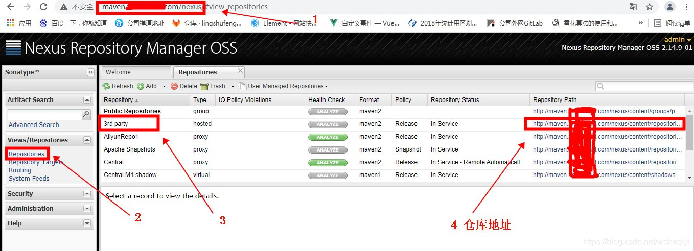
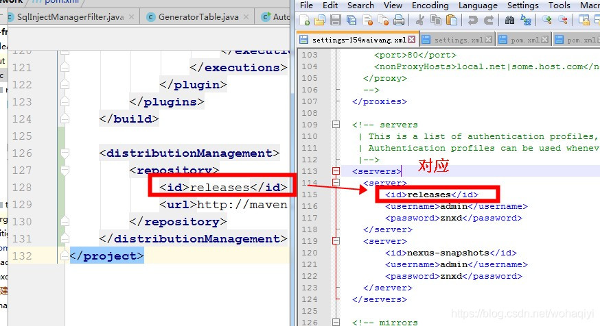
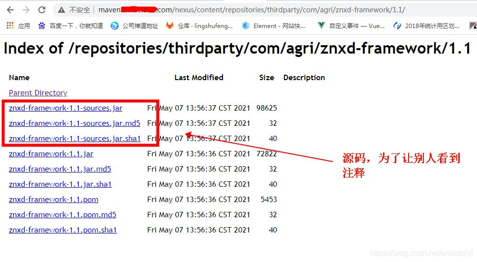

[maven==docker搭建私有maven仓库，编写starter并发布到私有maven仓库，在项目中使用私有仓库中的starter](https://blog.csdn.net/hebian1994/article/details/126084836)

[如何自定义一个springboot starter（超详细）](https://blog.csdn.net/johnhum123/article/details/118880781?utm_medium=distribute.pc_relevant.none-task-blog-2~default~baidujs_title~default-2-118880781-blog-93760751.pc_relevant_vip_default&spm=1001.2101.3001.4242.2&utm_relevant_index=5)

[maven打包上传到私有仓库的步骤_茁壮成长的凌大大的博客-CSDN博客_maven发布到私有仓库](https://blog.csdn.net/wohaqiyi/article/details/116521311?spm=1001.2101.3001.6650.1&utm_medium=distribute.pc_relevant.none-task-blog-2~default~BlogCommendFromBaidu~default-1-116521311-blog-104807110.pc_relevant_vip_default&depth_1-utm_source=distribute.pc_relevant.none-task-blog-2~default~BlogCommendFromBaidu~default-1-116521311-blog-104807110.pc_relevant_vip_default&utm_relevant_index=2)

1. 背景
  最近有些自己制作的工具包，需要单独抽取出来之后，在打包的时候，同时上传到自己的maven私服仓库，供别人引用，并且还能够引用的时候看到源码。但是，在上传的过程中总是失败不成功，特别上火。最后总算成功，记录下步骤，希望能够帮助到需要的人。

<br/>

2. 步骤
  先说下我的要求：

本地打包能够自动上传maven私服仓库。
别人引用后，能够看到源码及注释。

<br/>

2.1 修改pom.xml
2.1.1 指定上传仓库地址
  首先需要到自己项目里的pom.xml里添加下边一段

```java
  <distributionManagement>
  <!--稳定版本的仓库地址,必须是允许上传的私服地址-->
        <repository>
            <id>releases</id>
            <url>http://maven.aaaaaa.com/nexus/content/repositories/thirdparty</url>
        </repository>
        <!--开发版本的仓库地址,必须是允许上传的私服地址-->
        <snapshotRepository>
            <id>nexus-snapshots</id>
            <url>http://maven.aaaaaa.com/nexus/content/repositories/snapshots</url>
        </snapshotRepository>
    </distributionManagement>

```

<br/>

  对于我们平时的项目版本号是类似XX-SNAPSHOT这种的，这类就是数据开发版本，这种上传私服后会以版本号+时间戳的形式递增，它上传必须要指定<snapshotRepository>地址,。
  上图中，id后边会说，这里的url的地址，是对应你仓库地址，你可以在浏览器里访问下类似http://maven.aaaaaa.com/nexus的地址，输入账号密码，登录后，如下图4对应的地址，就是：

<br/>

<br/>



<br/>

需要注意的是，因为上图中，我们仓库有好几个，我是上传到了3对应的仓库，你可以根据你们实际的仓库地址来就行。
  另外id对应的releases其实是与指定的maven配置文件conf/setttings.xml中对应，如下图所示：

<br/>



  如果对应的settings.xml里没有配置<servers>对应的标签，那也需要添加一下。如下示例：

```
  <servers>
    <server>
    	<!--与2.1.1中的id值对应-->
        <id>releases</id>
        <!--账号密码需要与私服登录账号密码一致-->
        <username>admin</username>
        <password>znxd</password>
    </server>
  </servers>

```

<br/>

2.1.2 添加源码插件
   上边的配置仅仅是指定仓库的地址，因为还需要让下载依赖的人，能够看到源码，因此还需要有一个插件，maven-source-plugin。再找到项目的pom.xml，添加如下插件：

```
<!-- 上传源码 -->
   <plugin>
        <groupId>org.apache.maven.plugins</groupId>
        <artifactId>maven-source-plugin</artifactId>
        <version>3.0.1</version>
        <configuration>
            <attach>true</attach>
        </configuration>
        <executions>
            <execution>
                <phase>compile</phase>
                <goals>
                    <goal>jar</goal>
                </goals>
            </execution>
        </executions>
    </plugin>

```

最后，总结一下现在pom.xml新增的这俩东西的位置：

```
<project>
	<!-----------省略多余的依赖---------->
	<build>
        <plugins>
         <!-----------省略多余的plugin---------->
         <!-- 上传源码 -->
            <plugin>
                <groupId>org.apache.maven.plugins</groupId>
                <artifactId>maven-source-plugin</artifactId>
                <version>3.0.1</version>
                <configuration>
                    <attach>true</attach>
                </configuration>
                <executions>
                    <execution>
                        <phase>compile</phase>
                        <goals>
                            <goal>jar</goal>
                        </goals>
                    </execution>
                </executions>
            </plugin>
        </plugins>
    </build>
    <distributionManagement>
        <repository>
            <id>releases</id>
            <url>http://maven.aaaaa.com/nexus/content/repositories/thirdparty</url>
        </repository>
    </distributionManagement>
</project>

```

**  注意：不能引用spring-boot-maven-plugin插件，这个插件一旦引入生效，就表示你当前做的jar包是一个可运行的包，而不是我们往私服上传的工具包了**

<br/>

2.3 成功后的依赖
   上传成功后，可以通过地址找一下，如下图即表示成功：



3. 扩展
   比如你做这个依赖包，可能后边还会有更新的时候，但是如果以前的依赖包已经被别人使用，那不可能一个个的通知使用者，maven本身提供这种自动下载高版本的功能，只需要对version标签的值改一下。如下：

```
<dependency>
     <groupId>com.agri</groupId>
     <artifactId>znxd-framework</artifactId>
     <version>[1.0,)</version>
 </dependency>

```