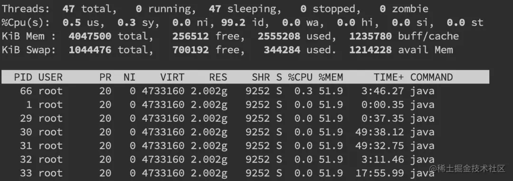
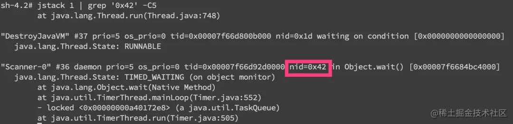
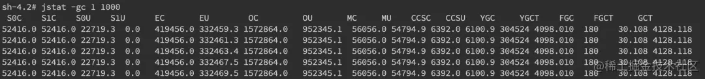
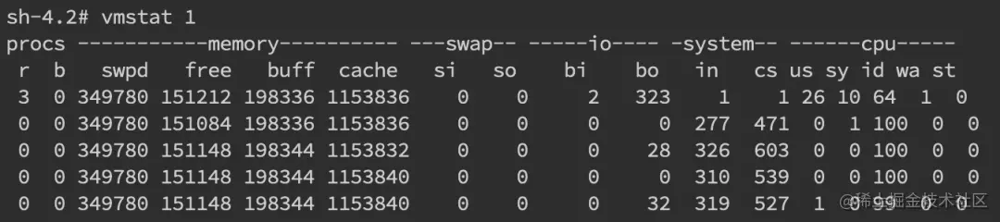
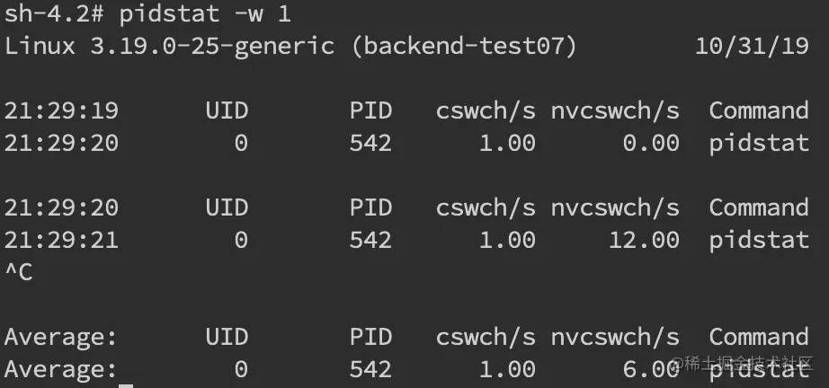

**我们先用ps命令找到对应进程的pid(如果你有好几个目标进程，可以先用top看一下哪个占用比较高)。**

 

1. 接着用 top -H -p pid来找到cpu使用率比较高的一些线程

2. 然后将占用最高的pid转换为16进制printf '%x\n' pid得到nid

3. 接着直接在jstack中找到相应的堆栈信息jstack pid |grep 'nid' -C5 –color
   
   
   
   可以看到我们已经找到了nid为0x42的堆栈信息，接着只要仔细分析一番即可。
当然更常见的是我们对整个jstack文件进行分析，通常我们会比较关注WAITING和TIMED_WAITING的部分，BLOCKED就不用说了。我们可以使用命令cat jstack.log | grep "java.lang.Thread.State" | sort -nr | uniq -c来对jstack的状态有一个整体的把握，如果WAITING之类的特别多，那么多半是有问题啦。

 

 

#### 频繁gc

当然我们还是会使用jstack来分析问题，但有时候我们可以先确定下gc是不是太频繁，使用jstat -gc pid 1000命令来对gc分代变化情况进行观察，1000表示采样间隔(ms)，S0C/S1C、S0U/S1U、EC/EU、OC/OU、MC/MU分别代表两个Survivor区、Eden区、老年代、元数据区的容量和使用量。YGC/YGT、FGC/FGCT、GCT则代表YoungGc、FullGc的耗时和次数以及总耗时。如果看到gc比较频繁，再针对gc方面做进一步分析。

 

#### 上下文切换

 

**针对频繁上下文问题，我们可以使用vmstat命令来进行查看**

cs(context switch)一列则代表了上下文切换的次数。

如果我们希望对特定的pid进行监控那么可以使用 pidstat -w pid命令，cswch和nvcswch表示自愿及非自愿切换。

